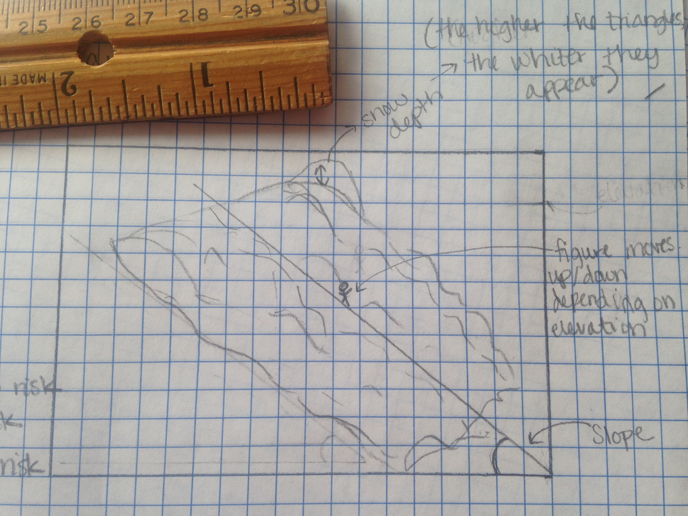

##Final Project Idea ~ Avalanche Risk Visualizer

Although avalanches are natural disasters, they can be exacerbated due to unsafe human interaction. The goal of this program is to educate and/or reinforce which factors cause the most risk for an avalanche by having an interactive display. The goal is for the user to become more knowledgeable about avalanches, to take further actions to be safer, and to gain more confidence, resulting in less people being at risk. The factors that will be used are slope, elevation and temperature, and snow depth. 

The mountain will be made out of a mesh. The program will use Leap Motion and the ofxLeapMotion addon so the program is based on the movement of your hands. The angle of your hand will change the slope, moving your hand up and down will change the elevation and temperature depending on that height, and the snow depth will change depending on how open or closed your hand is. These factors will change the overall appearance of the program and will display the risk.

Depending on how much you are at risk, the mountain will glow a certain color.
- Green glow = almost no risk
- Yellow glow = some risk
- Red = danger, at risk
The glow will be made by using the ofxFboBlur addon.

Below is a simple sketch of what the display will look like:

Slope:
- The degree will be listed under the slope line and will increase or decrease depending on the angle of your hand.
- If the slope is between 15 and 45 degrees, the number and slope line will be displayed in red. (Being on slopes that are between 15 and 45 degrees make you more at risk).

Elevation:
- A stick figure represents where you are on the mountain. 
- Moving your hand up or down will move the figure up and down the slope line.
- The higher in elevation you are, the colder the temperatures and the more you are at risk.

Snow depth:
- The color of the mesh will be based on the height of the noise. 
- The heigher the noise, the more white there is.
- The more your hand is opened, the heigher the noise, the heigher the snow depth(more white) and the more you are at risk.

Addons:
- ofxLeapMotion
- ofxFboBlur
- possibly some kind of typography addon for the text displayed in program.